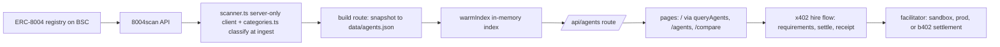

# Agent Souk


Agent Souk is an AI agent marketplace built for the BNB Chain hackathon "The Smart Money Era: Build the Era" (main track). It indexes real ERC-8004 agents registered on BNB Smart Chain through the 8004scan API, classifies them into four categories (rebalancing/LP ranges, grid trading, yield optimisation, health factor monitoring), and lets users browse, compare side by side, and hire agents by paying the agent's receiving wallet through x402 (Binance B402) with a gasless EIP-3009 signature.

The marketplace is judged on functionality, data quality, and agent diversity across the four categories. Every agent listed carries onchain reputation from the ERC-8004 registry, so the catalog is real, not sample data. The current snapshot holds 168 real BSC agents: 47 rebalancing and LP ranges, 44 yield, 34 health-factor, 13 grid-trading, and 30 general. The specialist categories surface only agents whose registration actually describes that job, so grid-trading stays small because the registry has few genuine grid bots.

## Features

- Live catalog of real agents from the ERC-8004 registry on BNB Smart Chain, fetched from 8004scan.
- Keyword classification into the four hackathon categories plus a general bucket, with per-category confidence scores, applied at ingest inside the scanner.
- Browse, filter, search, and sort across the catalog on the /agents page.
- Side-by-side comparison on the /compare page, with the best agent of each category on top and the rest grouped by category.
- x402 hire flow with a gasless EIP-3009 signature and a sandbox, prod, or b402 settlement mode.
- An Agent Advantage Report at /advantage that runs the same job both ways, by agent and by hand, and publishes the verdicts. The full TermiX report is in docs/termix-advantage-report.md.
- Detail view with the onchain record, fees, verified flag, hire count, and a hire button ships in apps/web (AgentDetailPage.tsx); the Next.js app route for it is a stub.

## Architecture

The data pipeline lives in src/lib/scanner.ts, a server-only 8004scan API client. It exposes fetchAgentsPage(p), fetchAgentDetail(chainId, tokenId), fetchFeedbacks, fetchPlatformStats, and searchAgents(q, limit). Search uses the ?search= list parameter, because the semantic /agents/search endpoint returns 502 errors and keyword search is a reliable replacement. The scanner keeps an in-memory index queried through queryAgents({category, q, sort, page, limit}) and warmed by warmIndex, which reads a snapshot from data/agents.json when one is present.

Classification happens in src/lib/categories.ts. It is a weighted-term keyword classifier with a threshold of at least 2, labelling each agent as rebalancing, grid-trading, yield, health-factor, or general, and producing confidence scores per category.

The snapshot builder is the API route src/app/api/index/build/route.ts. A POST to /api/index/build?secret=... fetches per-category keyword searches plus the 12 newest pages in parallel batches. Anonymous access runs 8 requests at a time with 6.1 second gaps; with an EIGHT004_API_KEY it runs 24 at a time with 200 millisecond gaps. The builder drops known spam cohorts (Ensoul mock Twitter profiles, dgrid.ai airdrop farmers), dedupes entries (at most 3 per normalized name, trailing digits stripped so numbered batch series count as one), ranks inside each category by relevance (category score times 10, plus 2 when the agent accepts x402, plus a small reputation term), and backfills a thin category only with agents that carry a real signal for it, then writes a category-balanced selection to data/agents.json.

The hire flow is split across src/lib/x402.ts, which holds the shared types, the EIP-3009 typed data, and an in-memory ledger, and src/lib/facilitator.ts, which verifies the EIP-3009 signature with viem and settles it in one of three modes. Addresses are checksum-normalized because the registry stores lowercased token addresses and viem rejects non-checksummed addresses. The API routes are /api/x402/requirements, /api/x402/settle, and /api/x402/receipt/[paymentId]. FACILITATOR_MODE defaults to sandbox, which verifies the signature and records a receipt without moving funds. Set it to prod to relay the buyer's EIP-3009 authorization on BNB Chain mainnet: the relay wallet (RELAY_PRIVATE_KEY) pays gas, the buyer only signs, and the transfer goes to the agent's own receiving wallet under a 5 U cap. Set it to b402 to route through papi.binance.com/papi/v2/b402/verify and /settle using B402_CLIENT_ID and B402_ACCESS_TOKEN. Because EIP-3009 validAfter and validBefore are checked on chain against block.timestamp, both the web app and the facilitator anchor the validity window to the chain's latest block time rather than the host clock, so a drifting host clock cannot sign an authorization that is already expired when the relay broadcasts it.

The pages are / (landing page with live stats and featured agents per category), /agents (browse, filter, search, and sort, client-rendered through the /api/agents route with a warm param), and /compare (best in each category on top, the rest grouped by category as cards). The agent detail view lives in apps/web/src/pages/AgentDetailPage.tsx and is not yet wired as a route in the Next.js app.



The same facts in prose: registry agents flow through the 8004scan API into the server-only scanner and are classified at ingest, then a build route writes a balanced snapshot that warms the in-memory index serving the pages through the /api/agents route, and hiring runs through the x402 requirements, settle, and receipt routes into the facilitator.

## Setup

```bash
npm install
npm run dev
```

Open http://localhost:3000 to see the marketplace.

## Environment variables

Create a .env.local file at the project root. Only EIGHT004_API_KEY changes the core pipeline; the rest configure the hire flow.

| Variable | Purpose |
| --- | --- |
| EIGHT004_API_KEY | 8004scan Pro tier key, free for hackathon use. Raises the rate limit from 10 requests per minute to 500. |
| FACILITATOR_MODE | sandbox (default), prod, or b402. |
| RELAY_PRIVATE_KEY | Required when FACILITATOR_MODE is prod. Pays gas to broadcast the buyer's authorization on BNB Chain. |
| B402_CLIENT_ID | Required when FACILITATOR_MODE is b402. |
| B402_ACCESS_TOKEN | Required when FACILITATOR_MODE is b402. |
| INDEX_SECRET | Secret guarding the snapshot build route. Defaults to dev. |

## Commands

| Command | What it does |
| --- | --- |
| npm install | Install dependencies. |
| npm run dev | Start the development server. |
| npm run build | Build for production. |
| npm start | Run the production server on port 3000. |
| npm run lint | Lint the codebase. |

## Regenerating the snapshot

Rebuild the agent snapshot with a POST to the build route:

```bash
curl -X POST "http://localhost:3000/api/index/build?per=40"
```

Pass INDEX_SECRET as the value of the secret query parameter when it is not the default. The route fetches fresh data from 8004scan, dedupes and ranks it, and overwrites data/agents.json with a category-balanced selection.

## Testing the hire flow

An end-to-end x402 test runs with node scripts/settle-test.mjs. It requires the server to be running. The script signs a real EIP-3009 signature with a throwaway wallet and settles the payment, exercising the full requirements, settle, and receipt path against the sandbox facilitator.

A mainnet settlement test runs with node scripts/prod-settle-test.mjs. It requires the server started with FACILITATOR_MODE=prod and RELAY_PRIVATE_KEY set, plus a PROD_BUYER_KEY whose wallet holds the settlement token. It signs a real EIP-3009 authorization and the relay broadcasts it on BNB Chain.

## Known limitations

- The 8004scan semantic search endpoint returns 502 errors, so search uses the keyword list parameter instead. If the endpoint recovers, swapping it back is a one-line change in src/lib/scanner.ts.
- The in-memory index warms from data/agents.json on cold start, so a fresh deployment serves the last snapshot until the build route runs again.
- Grid trading is intentionally thin (13 agents) because the registry has few genuine grid bots; the builder backfills only with agents whose registration carries a real signal, and the UI reports the count honestly.
- FACILITATOR_MODE defaults to sandbox settlement, which verifies the signature and records a receipt without moving funds. Set it to prod to settle on BNB Chain mainnet (RELAY_PRIVATE_KEY pays gas), or b402 to route through the Binance production endpoint with B402_CLIENT_ID and B402_ACCESS_TOKEN.
- The x402 ledger is in-memory; receipts survive per process, not across restarts.
- Hiring supports standard (EOA) wallets only. Smart-account wallets (ERC-4337, e.g. Coinbase Smart Wallet) sign EIP-3009 authorizations whose signatures validate on-chain via ERC-1271, which the facilitator cannot verify with off-chain ecrecover; the web app detects a connected smart account and shows an explicit message instead of a settlement failure. An opt-in on-chain ERC-1271 verifier ships behind `SMART_WALLET_VERIFY=on` (default off), but it cannot unlock settlement today: live probes (3 independent BSC RPCs + implementation bytecode dispatcher scan) show the deployed BSC USDC (0x8AC7…580d) exposes no EIP-3009 `transferWithAuthorization` at all (neither the v/r/s nor the ERC-1271-capable bytes variant), so signature-based settlement reverts at the token regardless of wallet type. Token-level findings and unlock conditions: .superpowers/smart-wallet-audit.md.

## Standards

- ERC-8004 agent identity, with the BSC registry at 0x8004a169fb4a3325136eb29fa0ceb6d2e539a432.
- ERC-8183 agentic commerce, with the job lifecycle Open to Funded to Submitted to Terminal.
- Binance x402 (B402) payment with gasless EIP-3009 signatures.

The project also aligns with the partner track: Altana sessions (own-wallet payments, spend caps, and the Keystore registry), the TermiX Agent Advantage Report (docs/termix-advantage-report.md), and PancakeSwap.

## Project reference

| File | What it is |
| --- | --- |
| src/lib/scanner.ts | Server-only 8004scan API client and in-memory index. |
| src/lib/categories.ts | Weighted-term keyword classifier for the four categories. |
| src/app/api/index/build/route.ts | Snapshot builder that writes data/agents.json. |
| src/lib/x402.ts | Shared x402 types, EIP-3009 typed data, in-memory ledger. |
| src/lib/facilitator.ts | Signature verification with viem plus sandbox, prod, and b402 settlement. |
| apps/web/src/pages/AgentDetailPage.tsx | Agent detail view (Vite app; not yet routed in the Next.js app). |
| scripts/settle-test.mjs | End-to-end x402 settlement test against the sandbox facilitator. |
| scripts/prod-settle-test.mjs | End-to-end x402 settlement test against BNB Chain mainnet (prod mode). |
| docs/termix-advantage-report.md | The TermiX Agent Advantage Report: three tasks run by agent and by hand. |
| data/agents.json | Current snapshot of 168 real BSC agents. |