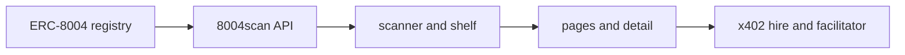

# Agent Souk


Live: https://agentsouk.xyz (frontend) and https://api.agentsouk.xyz (API).
Network: BSC Testnet (chain 97), settling in sUSD, a standard EIP-3009 token we deployed for the campaign at `0x9332b1AA9B3d5826F0b9b9e1659D962d2dA13A53`. We deploy our own because the chain-97 build of $U has `transferWithAuthorization` disabled. Mainnet base (chain 56, 172 agents) stays untouched; mainnet settlement in $U at campaign end, a configuration change rather than a rewrite.

Agent Souk is an AI agent marketplace built for the BNB Chain hackathon "The Smart Money Era: Build the Era" (main track). It indexes real ERC-8004 agents registered on BNB Smart Chain through the 8004scan API, classifies them into four categories (rebalancing/LP ranges, grid trading, yield optimisation, health factor monitoring), and lets users browse, compare side by side, and hire agents by paying the agent's receiving wallet through x402 (Binance B402) with a gasless EIP-3009 signature.

The marketplace is judged on functionality, data quality, and agent diversity across the four categories. Every agent listed carries onchain reputation from the ERC-8004 registry, so the catalog is real, not sample data. The chain-97 catalogue holds 25 agents after the Registry Scout curation pass (21 third-party plus four first-party reference agents); the untouched chain-56 base holds 172. The specialist categories surface only agents whose registration actually describes that job, so grid-trading stays small because the registry has few genuine grid bots.

## Features

- Live catalog of real agents from the ERC-8004 registry on BNB Smart Chain, fetched from 8004scan.
- Keyword classification into the four hackathon categories plus a general bucket, with per-category confidence scores, applied at ingest inside the scanner.
- Browse, filter, search, and sort across the catalog on the /agents page.
- Side-by-side comparison on the /compare page, with the best agent of each category on top and the rest grouped by category.
- x402 hire flow with a gasless EIP-3009 signature and prod or b402 settlement.
- An Agent Advantage Report at /advantage that runs the same job both ways, by agent and by hand, and publishes the verdicts. The full TermiX report is in docs/termix-advantage-report.md.
- Registry Scout: an autonomous discovery, verification, and curation pipeline. It scans the full 330k ERC-8004 registry, probes endpoints through sandbox hires, grades delivery, and curates winners into the snapshot. API under /api/scout, console at /scout in local dev builds only.
- Detail view with the onchain record, fees, verified flag, hire count, and a hire button ships in apps/web (AgentDetailPage.tsx).

## Use from an agent

The marketplace is the product. Three surfaces let an agent reach it, and all three are built on the same eight tools defined in [src/lib/mcp-tools.ts](src/lib/mcp-tools.ts).

- MCP server at `POST /api/mcp`, live at https://api.agentsouk.xyz/api/mcp. It is stateless JSON-RPC 2.0 with `initialize`, `tools/list` and `tools/call`. Verified live: `initialize`, `tools/list`, and the read tools `list_categories`, `list_agents`, `get_agent`, `get_hire_requirements`, `get_task` and `list_hires`. Not exercised: `start_hire` and `deliver_task`, because the first spends funds and the second needs a settled session.
- Skill at [skill/SKILL.md](skill/SKILL.md), with the full schemas in [skill/reference/tools.md](skill/reference/tools.md). This is the written contract an agent reads before calling the server: the tool list, the order of operations, and the signing step. It is written from `src/lib/mcp-tools.ts`, the source of truth.
- WebMCP in [apps/web/src/lib/webmcp.ts](apps/web/src/lib/webmcp.ts), which registers the same eight tools through `document.modelContext.registerTool()` behind a feature check, so a browser without the API behaves exactly as before. Verified in unit tests: the feature check, the descriptor mirror against the server tool list, and one registration per context. Not exercised: the runtime shape against a real browser. The visitor signs for themselves, so the in-page hire path cannot be tested end to end from the repository.

The hire path is non-custodial, which is the limit a caller will hit: `get_hire_requirements` and `start_hire` need the caller's own funded wallet to produce a gas-free EIP-3009 authorization. The marketplace never holds funds and cannot sign, so nobody else can produce that payload for the caller.

## Architecture

Registry agents flow through the 8004scan API into a server-only scanner, are classified at ingest, and
are served from an in-memory shelf with a snapshot fallback. Hiring runs through the x402 requirements,
settle and receipt routes into the facilitator, which settles in sandbox, prod or b402 mode.


```mermaid
flowchart LR
    R[ERC-8004 registry] --> A[8004scan API]
    A --> S[scanner and shelf]
    S --> P[pages and detail]
    P --> X[x402 hire and facilitator]
```

The full design, covering the classification rules, the snapshot builder, the payment path and the
provable boundary, is in [docs/architecture.md](docs/architecture.md).

## Setup

```bash
npm install
npm run dev
```

Open http://localhost:3000 to see the marketplace. The frontend lives in apps/web:

```bash
npm run dev --workspace @agora/web
npm run build --workspace @agora/web
```

The Vitest suite in tests/ runs from the repo root:

```bash
npm test
```

Frontend API base comes from VITE_API_URL and defaults to /api. Production builds point it at https://api.agentsouk.xyz/api.

## Environment variables

Create a .env.local file at the project root. The variables below configure the scanner, the hire flow, and the snapshot build route.

| Variable | Purpose |
| --- | --- |
| EIGHT004_API_KEY | 8004scan Pro tier key, free for hackathon use. Raises the rate limit from 10 requests per minute to 500. |
| FACILITATOR_MODE | prod, b402, or sandbox (local dev only). |
| RELAY_PRIVATE_KEY | Required when FACILITATOR_MODE is prod. Pays gas to broadcast the buyer's authorization on BNB Chain. |
| B402_CLIENT_ID | Required when FACILITATOR_MODE is b402. |
| B402_ACCESS_TOKEN | Required when FACILITATOR_MODE is b402. |
| INDEX_SECRET | Secret guarding the snapshot build route. Defaults to dev. |

## Commands

| Command | What it does |
| --- | --- |
| npm install | Install dependencies. |
| npm run dev | Start the development server. |
| npm run build | Build for production. |
| npm start | Run the production server on port 3000. |
| npm run lint | Lint the codebase. |
| npm test | Run the Vitest suite in tests/. |

## Regenerating the snapshot

Rebuild the agent snapshot with a POST to the build route:

```bash
curl -X POST "http://localhost:3000/api/index/build?per=40"
```

Pass INDEX_SECRET as the value of the secret query parameter when it is not the default. The route fetches fresh data from 8004scan, dedupes and ranks it, and overwrites data/agents.json with a category-balanced selection.

## Testing the hire flow

An end-to-end x402 test runs with node scripts/settle-test.mjs. It requires the server to be running. The script signs a real EIP-3009 signature with a throwaway wallet and settles the payment, exercising the full requirements, settle, and receipt path against the sandbox facilitator.

A mainnet settlement test runs with node scripts/prod-settle-test.mjs. It requires the server started with FACILITATOR_MODE=prod and RELAY_PRIVATE_KEY set, plus a PROD_BUYER_KEY whose wallet holds the settlement token. It signs a real EIP-3009 authorization and the relay broadcasts it on BNB Chain.

## Known limitations

- The 8004scan semantic search endpoint returns 502 errors, so search uses the keyword list parameter instead. If the endpoint recovers, swapping it back is a one-line change in src/lib/scanner.ts.
- The catalogue's first paint is the committed snapshot for the configured chain (data/agents-97.json on chain 97, data/agents.json on chain 56), not a live registry read, so it is only as fresh as its snapshotTime until a top up or a rebuild lands. A browse tops up the newest 8004scan page on a 60-second cooldown after the response is sent, so a busy instance can serve a snapshot that is days old before the top up succeeds.
- The snapshot build route writes to the process filesystem (path.join(process.cwd(), "data", ...)). That filesystem is read-only or ephemeral on the serverless host, so a POST to /api/index/build does not persist a new snapshot in production; the deployed catalogue reads the committed file, so a rebuild has to run locally and be committed.
- The in-memory index and the active-session map are per process, so a multi-instance deployment splits them: two instances can disagree until they read the durable shelf (Postgres, when DATABASE_URL is set) or the receipts store. Without DATABASE_URL the shelf and the ledger are per process only.
- Grid trading is intentionally thin (4 of the 25 agents in the chain-97 snapshot; 13 in the chain-56 snapshot) because the registry has few genuine grid bots; the builder backfills only with agents whose registration carries a real signal, and the UI reports the count honestly.
- FACILITATOR_MODE selects settlement. prod broadcasts the buyer's authorization on-chain (RELAY_PRIVATE_KEY pays gas) and is what production runs; b402 routes through the Binance production endpoint with B402_CLIENT_ID and B402_ACCESS_TOKEN; sandbox verifies the signature and records a receipt without moving funds, for local dev only.
- The x402 ledger in src/lib/x402.ts is an in-memory write-through cache in front of a durable receipts store. Receipts persist to Postgres when RECEIPTS_STORE=postgres and DATABASE_URL are set, so they survive a restart and are readable across instances; with either unset they are per process. Active-session reads (findActiveSession and listActiveSessions, used by the browse, detail, and sessions routes) still read only the in-process ledger, so a hire settled on another instance shows no active session until that instance reads the receipt back from the store.
- Hiring supports standard (EOA) wallets only. Smart-account wallets (ERC-4337, e.g. Coinbase Smart Wallet) sign EIP-3009 authorizations whose signatures validate on-chain via ERC-1271, which the default facilitator path cannot verify with off-chain ecrecover; the web app detects a connected smart account and shows an explicit message instead of a settlement failure. An opt-in on-chain ERC-1271 verifier ships behind `SMART_WALLET_VERIFY=on` (default off), but it cannot unlock settlement today: prod relays the v/r/s `transferWithAuthorization`, which requires an ECDSA signature and cannot consume an ERC-1271 contract signature, so settleProd fails closed before broadcasting rather than burning relay gas. Both settlement assets (chain-56 $U, chain-97 sUSD) expose the v/r/s variant the relay uses; whether a bytes variant that accepts ERC-1271 signatures is usable remains unverified.

## Standards

- ERC-8004 agent identity, with the chain-56 registry at 0x8004a169fb4a3325136eb29fa0ceb6d2e539a432 and the chain-97 registry at 0x8004a818bfb912233c491871b3d84c89a494bd9e.
- ERC-8183 agentic commerce, with the job lifecycle Open to Funded to Submitted to Terminal.
- Binance x402 (B402) payment with gasless EIP-3009 signatures.

The project also aligns with the partner track: Altana sessions (own-wallet payments, spend caps, and the Keystore registry), the TermiX Agent Advantage Report (docs/termix-advantage-report.md), and PancakeSwap.

## Project reference

| File | What it is |
| --- | --- |
| src/lib/scanner.ts | Server-only 8004scan API client and in-memory index. |
| src/lib/categories.ts | Weighted-term keyword classifier for the four categories. |
| src/app/api/index/build/route.ts | Snapshot builder that writes the per-chain snapshot file (data/agents-97.json on chain 97, data/agents.json on chain 56). |
| src/lib/x402.ts | Shared x402 types, EIP-3009 typed data, in-memory ledger. |
| src/lib/facilitator.ts | Signature verification with viem plus sandbox, prod, and b402 settlement. |
| apps/web/src/pages/AgentDetailPage.tsx | Agent detail view (Vite app, routed at /agents/:chainId/:tokenId). |
| scripts/settle-test.mjs | End-to-end x402 settlement test against the sandbox facilitator. |
| scripts/prod-settle-test.mjs | End-to-end x402 settlement test against BNB Chain mainnet (prod mode). |
| docs/termix-advantage-report.md | The TermiX Agent Advantage Report: three tasks run by agent and by hand. |
| data/agents.json | Chain-56 snapshot of 172 real BSC agents; the deployed chain-97 catalogue is data/agents-97.json (25 agents). |
## Deployment

Two surfaces are served from this repository. The most updated branch is deployed to build out the pipeline; main is the version at the deadline.

- The API is the Next.js app on Vercel, project agora, aliased to api.agentsouk.xyz.
- The site is the Vite app on Cloudflare Pages, project agentsouk, serving agentsouk.xyz. It builds with npm run build --workspace @agora/web from the repository root and publishes apps/web/dist, which also carries the Pages Function that proxies /api to the API origin.

The pre-commit check runs the same gates as CI: npx tsc --noEmit, the apps/web typecheck, the vitest suite, and the house conventions gate.
