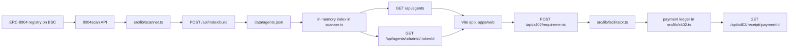
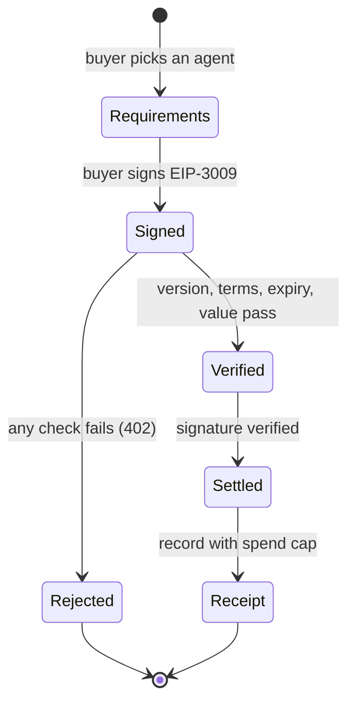

## Agent Souk Architecture Documentation

This document covers how Agent Souk, the ERC-8004 agent marketplace on BNB Smart
Chain, works. It explains the server-only registry boundary, the
grounded-in-data classification model, the snapshot build pipeline, the
marketplace-as-merchant money path over Binance x402, and the sandbox versus
b402 facilitation split. It also documents the current shape of the system:
the live Next.js product and the Vite frontend rebuild that is replacing its
pages, and the shared core package that will become the single source for
both.

Agent Souk's design choices -- separating the registry client from the client
bundle, classifying agents from their own registration text rather than from
manual curation, serving a committed snapshot with live fallback, routing
payment to the agent's own receiving wallet with no custody, and keeping the
pure logic shared between the two apps in one package -- were made so every
number a buyer sees is checkable on chain, no actor in the loop can move money
they do not own, and no claim rests on a curated list.

### Design Principles

**The server-only boundary**

All registry access lives in `src/lib/scanner.ts`, which imports `server-only`
and never ships to the browser. The registry client, the classifier, the
in-memory index, and the API routes that read them are server code. The client
bundle receives only what the API routes return. This keeps 8004scan keys and
registry plumbing out of the browser and makes the API layer the only surface
the frontend trusts.

The same boundary holds for payment: the ledger, the facilitator, and the
signature verification in `src/lib/x402.ts` and `src/lib/facilitator.ts` are
server-only. A buyer never sees the merchant internals, only the requirements
to sign.

**Grounded-in-data classification**

Classification reads the agent's own registration text: name, description, and
supported trust models joined into one haystack. Weighted keyword terms per
category decide the bucket, with precise phrases at weight 2 and generic words
at weight 1, and a threshold of 2 before an agent leaves the general bucket.
Nothing is curated by hand, and nothing is mocked. The spam filter removes
known cohorts by pattern, the dedupe collapses numbered batch registrations,
and ranking is fit-first, so the catalog is what the registry says, read
carefully. The classifier lives in `packages/core` and is shared by both apps.

**The marketplace-as-merchant money path**

The marketplace never holds funds. When a buyer hires an agent, the payment
requirements name the agent's own receiving wallet, `agent_wallet` falling
back to `owner_address`, as the `payTo`. The buyer signs a gasless EIP-3009
transfer authorization, and a facilitator verifies the signature, checks the
signed terms match the requirements, and settles the exact amount. A forged or
replayed authorization cannot reach settlement, because verification is
cryptographic, not claimed.

**Snapshot-first serving**

The backend renders from a committed snapshot, `data/agents.json`, so it works
with no API key and no warm-up. The in-memory index loads the snapshot on first
query and falls back to pulling recent pages live only when no snapshot exists.
A snapshot is rebuilt against live data by the build route and committed, so
the numbers on screen are a reproducible artifact a judge can regenerate.

**Honest sparse categories**

A category the registry genuinely lacks stays small. The grid trading category
on BSC has about three real agents, and the pipeline reports that instead of
padding the bucket with unrelated listings. Backfill into a thin category only
accepts agents with a real classifier signal for that category, so coverage is
real or it is absent, never invented.

### System Architecture

The system is organized in five layers, matching the build pipeline.

**Registry input layer.** The ERC-8004 agent identity registry on BSC, chain
id 56, contract `0x8004a169fb4a3325136eb29fa0ceb6d2e539a432`, is read through
the 8004scan public API at `https://8004scan.io/api/v1/public`. Anonymous
access is rate-limited to 10 requests a minute; an `EIGHT004_API_KEY` sets the
`X-API-Key` header and raises the ceiling to 500. Search results are capped at
about 10 for anonymous access, and the semantic search endpoint returns 502, so
the pipeline uses the `search` query parameter on the list endpoint.

**Index layer.** `src/lib/scanner.ts` wraps the API: `fetchAgentsPage`,
`searchAgents`, `fetchAgentDetail`, `fetchFeedbacks`, and `fetchPlatformStats`.
It holds an in-memory `Map` keyed by `agent_id`, loaded from the snapshot by
`loadSnapshot`, warmed live by `warmIndex`, and queried by `queryAgents`. The
platform stats are fetched with a five-minute revalidate.

**Classification layer.** The classifier and rank live in `packages/core` as
`classifyAgent` and `relevanceScore`, with the signal weights as the constant
`SIGNALS`. The snapshot builder drives both.

**Serving layer.** The API routes are `GET /api/agents` (browse with category
counts, search, sort, paging, index status) and
`GET /api/agents/[chainId]/[tokenId]` (detail, preferring a fresh fetch and
falling back to the index). The pages are served by the Vite app: `/` is the
one-pager, `/agents` is the marketplace with category filter, search, sort,
and a compare shortlist, `/agents/[chainId]/[tokenId]` is the agent detail
page, and `/compare` renders a side-by-side table from shortlisted agents.

**Payment layer.** `src/lib/x402.ts` holds the shared types, the EIP-3009
typed data, and the in-memory ledger. `src/lib/facilitator.ts` holds the
sandbox settlement path. The routes are `POST /api/x402/requirements`,
`POST /api/x402/settle`, and `GET /api/x402/receipt/[paymentId]`.

The flow of data through the system:



### The Frontend Rebuild

`apps/web` is a React and Vite single-page app. The routes are the one-pager,
the marketplace, the agent detail page, and the compare page, backed by
`react-router-dom`. Data comes from the API through `src/lib/api.ts`, with the
base URL from `VITE_API_URL`, defaulting to `/api`. In development and preview
a Vite proxy forwards `/api` to the Next.js backend.

The design system is the editorial broadsheet: bone-white canvas, press-black
dark sections, a single highlighter-green accent, Inter for UI type and
Fraunces for display serifs. The tokens are in `src/theme.css` as Tailwind v4
theme values, and the brand reasoning is recorded in `brand.md`, which is an
internal working document and stays out of the repository.

Motion follows a single vocabulary defined in `src/lib/motion.ts`: spring
presets and an ease for fades. The one-pager choreographs its hero on mount and
reveals sections on scroll, the marketplace staggers cards and cross-fades on
filter change, and the hero tiles are animated vectors, strokes that draw in
and dots that travel their shapes. Every animation degrades under
`prefers-reduced-motion` through a global `MotionConfig`.

The compare shortlist is a local concern. Agents are checked in the
marketplace, the selection is persisted to `localStorage` under
`agent-souk.compare.ids`, and a sticky bar navigates to `/compare?ids=...`. The
compare page loads each agent's detail and renders a metric table.

The shared package `packages/core` exports the registry types, the classifier,
and the formatting helpers. It is the single source for the frontend today and
becomes the single source for the backend after the cutover.

### The Snapshot Build Phase

The build route is `POST /api/index/build`, guarded by the `secret` parameter
or the `INDEX_SECRET` env var, defaulting to `dev`. It takes `per`, the target
agents per category, clamped to 5 to 60 with a default of 40.

**Fetch.** The route fans out two job families in parallel batches: a
category-keyword search per term, and the newest registry pages. The search
terms per category are rebalancing (`rebalanc`, `liquidity range`,
`concentrated liquidity`, `LP range`), grid-trading (`grid trading`, `grid
bot`, `dca bot`, `grid strategy`, `spot grid`, `trading bot`, `automated
trading`, `quant bot`), yield (`yield`, `yield optimizer`, `staking`,
`farming`, `APY`), and health-factor (`health factor`, `liquidation`,
`lending`, `borrow`, `liquidation protection`, `aave`, `venus`, `collateral`,
`risk monitor`).

Batches respect the rate limit: anonymous runs 8 requests at a time with a 6.1
second gap between batches; with a key it runs 24 at a time with a 200
millisecond gap. The newest pages are pulled for 12 pages. Every raw
registration is folded into an `AgentSummary` by id.

**Spam filter.** An agent is dropped when its name or description matches one
of the known cohort patterns: Ensoul mock Twitter profiles, mock Twitter API
descriptions, seed or placeholder accounts, `dgrid.ai` airdrop farmers, and
airdrop allocation text.

**Dedupe.** Names are normalized by lowercasing, removing non-alphanumerics,
and stripping trailing digits, so a numbered batch series such as "BORT
Liquidity Bloom #10966" collapses to one product. At most 3 agents per
normalized name and one per normalized name plus owner pair are kept.

**Classify and pool.** Every surviving agent is classified once by
`classifyAgent` and placed in its best category or `general`. Pools are sorted
by `relevanceScore` within their category.

**Balanced selection.** Up to `per` agents are taken from each category pool in
relevance order. The general pool gets at least `max(16, floor(per / 2))`
agents. A category that ends under `max(12, per / 2)` is backfilled from the
remaining deduped agents, but only those with a raw classifier signal of at
least 1 for that category, relabeled accordingly.

The result is written as version 2 of the snapshot: a timestamp, the fetch
source counts, the per-category counts, and the selected agents. The shipped
snapshot holds 107 real BSC agents: 35 rebalancing, 40 yield, 9 health-factor,
3 grid-trading, 20 general.

### Classification and Ranking

The classifier signals live in `SIGNALS` in `packages/core`. Terms carry a
weight and optionally a stem flag. The health-factor category gives weight 2
to `health factor`, `healthfactor`, `liquidation`, `liquidate`, `liquidation
price`, `borrow position`, `lending position`, `position protection`,
`liquidation guard` and weight 1 to `collateral`, `aave`, `venus`,
`overcollateral`. Grid-trading gives weight 2 to `grid trading`, `grid bot`,
`grid order`, `grid strategy`, `accumulation grid`, `dca grid`, `trading grid`,
`automated grid`, `spot grid`, `grid trading bot` and weight 1 to `dca`,
`grid`. Rebalancing gives weight 2 to `rebalanc` (stem), `lp range`,
`liquidity range`, `concentrated liquidity`, `auto rebalance`, `position
reset`, `range reset`, `amm rebalance` and weight 1 to `lp management`,
`liquidity provision`, `pool position`, `liquidity provider`. Yield gives
weight 2 to `yield`, `apr`, `apy`, `staking optimizer`, `auto compound`, `best
yield`, `highest apr`, `liquidity mining` and weight 1 to `farming`, `vault`,
`reward optimizer`, `earn`.

Matching rules: a stem term matches as a plain substring, so `rebalanc` covers
`rebalance`, `rebalancing`, and `rebalanced`. A multi-word term matches as a
substring. A single-word non-stem term matches on word boundaries, so `grid`
does not match `dgrid.ai` and `earn` does not match `learning`.

The score per category is the sum of the weights of the terms that hit. An
agent enters the category with the highest score only when that score is at
least 2, otherwise it is `general`. The per-category scores are stored on the
agent as `categoryScores`, which the builder reads for backfill and the detail
page renders as the fit signal.

Within a category, agents are ordered by relevance:

```
relevanceScore = categoryScore * 10 + (x402 ? 2 : 0)
               + min(totalScore, 30) / 10 + totalFeedbacks / 100
```

Category relevance dominates, because the registry rewards account age via
`total_score` more than it rewards fit, and a fresh, precisely-matched agent
must beat an old generic persona agent. x402-capable agents edge ahead because
they are the hireable ones, then reputation breaks the remaining ties. The
browse route sorts with `total_score` as the tiebreak inside a category, and
pure `total_score` with feedbacks outside one.

### Serving Queries

`queryAgents` applies the category filter, then the search text over name,
description, and owner address, then the sort. The sort modes are `score`
(default, relevance-first inside a category), `newest` by registration time,
`feedback` by total feedbacks, and `health` by health score, descending, with
agents lacking one last. It returns the paged items, the total, the
per-category counts, and index status: fetched count, snapshot total, last
warm time, warming flag, and error.

Agent detail normalizes object-typed fields before they reach the client. The
registry can return `health_status` as a structure rather than a string, so
the detail fetch flattens it to its `overall_status` and coerces the endpoint
fields to strings, which keeps the client types honest and the pages from
crashing on an unexpected shape.

### The x402 Payment Path

**Requirements.** `POST /api/x402/requirements` produces payment terms for an
agent. The price defaults to `DEFAULT_HIRE_PRICE_USD = 2` and accepts an
`amountUsd` override. The asset is USDC on BSC,
`0x8AC76a51cc950d9822d68b83fe1ad97b32cd580d`, 18 decimals. The network is
`eip155:56`, the scheme is `exact`, and `maxTimeoutSeconds` is 300. The
`payTo` is the agent's receiving wallet or owner address. The requirements
name the resource being hired: the agent detail URL and a description.

**Signing.** The buyer signs an EIP-3009 `TransferWithAuthorization` message.
The EIP-712 domain is `{ name: "USD Coin", version: "2", chainId: 56,
verifyingContract: <USDC, checksummed> }`. The message fields are `from`, `to`,
`value`, `validAfter`, `validBefore`, and `nonce`. Addresses are normalized
through `getAddress` before the domain is built and before verification,
because the registry stores token addresses lowercased and viem rejects a
non-checksummed address in typed data encoding.

**Settlement.** `POST /api/x402/settle` dispatches on `FACILITATOR_MODE`. The
default is `sandbox`, verified by `settleSandbox` in `src/lib/facilitator.ts`:

1. Version check. The payload must carry `x402Version = 2`.
2. Term match. The signed `accepted.amount` and `accepted.payTo` must equal the
   requirements, so a replayed or edited authorization cannot settle.
3. Expiry and value. `validBefore` must be in the future and `value` positive.
4. Signature. `verifyTypedData` recomputes the domain hash and message hash and
   checks the signature against `from`.
5. Receipt. A receipt records the payment id, a deterministic sandbox tx hash,
   the agent, the client, the payTo, the amount, and a session with a spend cap
   of 10 USD expiring in 24 hours.

The sandbox tx hash is deterministic, not a chain transaction: a fixed prefix
followed by a hex encoding of the payment id without dashes.

In `b402` mode the route calls `papi.binance.com/papi/v2/b402/verify` then
`/settle` with the `X-B402-CLIENT-ID` and `Authorization: Bearer` headers from
`B402_CLIENT_ID` and `B402_ACCESS_TOKEN`, and passes through the returned
`txHash`. The mode is read per request, so the two coexist. b402 mode is wired
and unexercised, because it needs credentials the project does not have.

The settlement lifecycle:



### Integration Surfaces

The pages are the buyer's surface: the one-pager, the marketplace with
category filter, search, sort, and compare shortlist, the detail page with the
on-chain record and the hire flow, and the compare table. The API routes are
the data and payment surface. The test artifact is `scripts/settle-test.mjs`,
which signs a real EIP-3009 signature with a throwaway wallet, settles it
against a running server, and checks the receipt; a forged signature is also
exercised and rejected.

### The Next Stage

The migration plan is honest about what is not yet built. The Vite frontend is
the current frontend target, and it is previewed locally against the Next.js
backend. The next stage moves the backend out of Next.js into a standalone API
service that the frontend talks to directly, and it moves the payment ledger
and the agent index into Postgres so receipts and the catalogue survive
restarts and scale. The snapshot build becomes a scheduled refresh writing to
Postgres instead of a one-shot committed file. The hire path in the Vite app
will sign through a connected wallet, settle through the facilitator, and show
the receipt on the detail page. None of that stage is built yet.

### The Provable Boundary

What is provable: every listing is a real ERC-8004 registration on BSC,
readable through 8004scan, so any score, feedback, or hire count on screen is
checkable on chain, and the snapshot is a reproducible artifact regenerated
from the same public data. The settlement in sandbox mode is a real EIP-3009
signature that was cryptographically verified.

What is not yet provable: the sandbox receipt is held in memory and resets on
restart, and its tx hash is deterministic, not an on-chain transaction. b402
mode would produce a real on-chain transaction but has not run. The Vite
frontend is not yet deployed. These limits are stated in the docs rather than
hidden, and the demo never claims more than the sandbox proved.