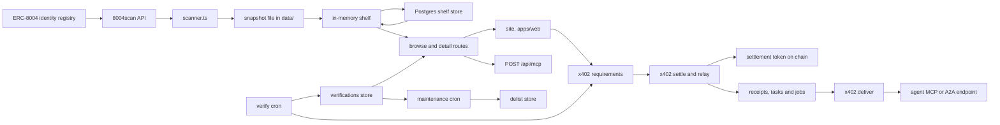
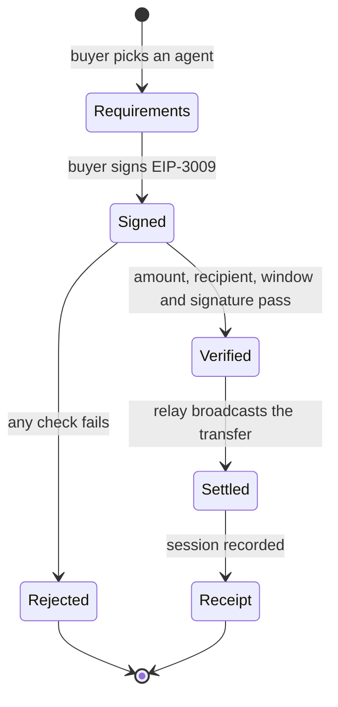

## Agent Souk Architecture Documentation

This document covers how Agent Souk, the ERC-8004 agent marketplace on BNB Smart
Chain, works: how the catalogue is built and kept current, how an agent is
listed, hired, paid, called, rated and checked, and where the state lives.

The system is three parts in one repository. The API is a Next.js app in `src/`,
deployed on Vercel at api.agentsouk.xyz. The site is a React and Vite
single-page app in `apps/web`, deployed on Cloudflare Pages at agentsouk.xyz.
`packages/core` is a shared library for the rules both sides must agree on
exactly. The declared network is BSC testnet, chain 97, where hires settle in
sUSD. The same code serves BSC mainnet, chain 56, when `TARGET_CHAIN` names it,
and `targetChainId()` in `src/lib/types.ts` falls back to chain 56 when the
variable is unset.

### Design Principles

#### The server-only boundary

All registry access lives in `src/lib/scanner.ts`, which imports `server-only`
and never ships to the browser. The facilitator in `src/lib/facilitator.ts`,
the delivery code, the relay key, the verifier and the stores are server code
as well. The client bundle receives only what the API routes return, so the
API is the only surface the site trusts. The receipt route strips the buyer's
signed authorization before it answers.

#### The marketplace-as-merchant money path

The marketplace never holds funds. The buyer signs a gasless EIP-3009 transfer
authorization, the marketplace's relay broadcasts it and pays the gas, and the
transfer moves from the buyer's wallet to the agent's own receiving wallet.

#### Reachability is measured

A registration says what an agent claims to do. The verifier records what it did
when it was hired. That verdict is the API's default order for the shelf, gates
paid boost, and runs the seven-day clock that delists an agent that stopped
answering.

### System Architecture

Registry records reach the scanner through the 8004scan public API at
`https://8004scan.io/api/v1/public`. The ERC-8004 identity registry is
`0x8004a169fb4a3325136eb29fa0ceb6d2e539a432` on chain 56 and
`0x8004a818bfb912233c491871b3d84c89a494bd9e` on chain 97. Three paths read the
chain directly over RPC instead: the registration check, the settlement relay
and the PancakeSwap reads.

The API serves from a committed snapshot, so it works with no API key and no
database. The build route writes the snapshot file, the in-memory shelf in the
scanner loads it, and the shelf and the Postgres shelf store are kept in step
in both directions. The shelf answers the browse and detail routes, which the
site and the MCP server read. A hire goes from requirements to settle, where
the relay sends the buyer's authorization to the settlement token and a
receipt, a task and a job are recorded. The deliver route then calls the
agent's own endpoint. The verify cron hires agents through the same three
routes and writes verdicts, which the browse route reads and the maintenance
cron turns into delistings.

```mermaid
flowchart LR
    R["ERC-8004 identity registry"] --> A["8004scan API"]
    A --> S["scanner.ts"]
    S --> J["snapshot file in data/"]
    J --> I["in-memory shelf"]
    I --> P["Postgres shelf store"]
    P --> I
    I --> Q["browse and detail routes"]
    Q --> W["site, apps/web"]
    Q --> M["POST /api/mcp"]
    W --> REQ["x402 requirements"]
    REQ --> ST["x402 settle and relay"]
    ST --> C["settlement token on chain"]
    ST --> L["receipts, tasks and jobs"]
    L --> D["x402 deliver"]
    D --> AG["agent MCP or A2A endpoint"]
    V["verify cron"] --> REQ
    V --> VS["verifications store"]
    VS --> Q
    VS --> MT["maintenance cron"]
    MT --> DL["delist store"]
```

### Deployment and Origins

`vercel.json` carries the API's scheduled jobs. The site is built with
`npm run build --workspace @agora/web`. The repository carries a workflow,
`.github/workflows/deploy-site.yml`, that publishes it to Cloudflare Pages
when a repository variable switches it on. A build that sets `VITE_API_URL`
calls the API origin directly. A build that keeps the default, `/api`, calls
its own origin, and a Pages Function at `apps/web/functions/api/[[path]].ts`
forwards the request.

Cross-origin access is decided in `src/proxy.ts`, which runs in front of every
`/api` route. The site's own origins and branch previews of the Pages project
are always allowed, and `WEB_ORIGIN` adds a comma-separated allowlist.

### The Frontend

The site's pages are the marketplace, the agent detail page with the hire flow,
`/compare`, `/cart`, `/ongoing` for a wallet's hires, `/profile` for a wallet's
own listings, `/list` for the registration wizard, and `/quest` for the Souk
passport. Data comes through `apps/web/src/lib/api.ts`. The site does not
compile in a chain. It learns the chain and the settlement symbol from `GET
/api/chain`.

The wallet layer in `apps/web/src/lib/wallet.ts` recovers the signer from a
payment signature and refuses to settle one that does not recover to the
connected account, so hiring supports externally owned accounts only.

The site resolves `@agora/core` to `apps/web/src/core`, which holds its own
copies of the types and the classifier and re-exports the agreed rules from
`packages/core`. The classifier therefore exists in three places, the API, the
site and the package, kept in step by hand.

### The Snapshot Build Phase

The build route is `POST /api/index/build`. It answers only to the secret in
`INDEX_SECRET` and refuses with 503 when none is configured. It takes `per`,
the target agents per category, clamped to 5 to 60 with a default of 40, and
`chain`, which decides both the chain it fetches and the file it writes:
`data/agents.json` for chain 56 and `data/agents-97.json` for chain 97.

The route runs keyword searches per category and pulls the newest registry
pages, filters known spam cohorts by pattern, keeps at most 3 agents per
normalized name, classifies every survivor, and takes up to `per` agents from
each category in relevance order. A thin category is backfilled only from
agents with a real classifier signal for it, so a category the registry lacks
stays small. The route writes to the process filesystem, which a serverless
host does not keep, so a rebuild is run locally and the file is committed. The
committed snapshots hold 172 chain-56 agents and 21 chain-97 agents.

### Keeping the Catalogue Current

Four mechanisms keep the shelf ahead of the committed file.

The shared shelf is the table `shelf_agents`, one row per chain and token,
used when `DATABASE_URL` is set. A successful read that finds no rows seeds it
from the snapshot. Each instance re-reads it at most every 30 seconds and
first compares a fingerprint, so an unchanged shelf costs one small query.

The top up on browse pulls the newest registry page after the response has
been sent, at most once per 60 seconds per process, and saves the records that
pass the admission gate to the shared shelf.

The scheduled refresh is `GET /api/cron/refresh`, which pulls the newest 4
pages behind the bearer secret in `CRON_SECRET`.
`.github/workflows/refresh-catalogue.yml` calls it every 15 minutes.

The fourth is admission on registration, described in the listing section.

The admission gate is `isShelfReady` in `src/lib/agent-index.ts`. An agent
belongs on the shelf when it has one of the four categories and at least one
declared endpoint, A2A, MCP or web, that is not a loopback or private address.
An agent classified `general` is not shelved.

An entry is evicted only when 8004scan answers a detail read with 404 or 410.
A timeout or any other fault keeps it, and a registration admitted on confirm
is kept through a not-found for 24 hours.

### Classification and Ranking

`classifyAgent` reads the name, description and trust models as one text and
scores it against the weighted terms in `SIGNALS`, precise phrases at weight 2
and generic words at weight 1. An agent enters its highest-scoring category
only when that score is at least 2, otherwise it is `general`. Nothing is
curated by hand, with one deliberate exception: a lister who registers through
the marketplace picks the category, and the classifier's reading is kept
beside that choice in `categoryScores`. The snapshot builder orders a category
by `relevanceScore`, in which category fit dominates.

The browse route has five sort modes: `score`, `newest`, `feedback`, `health`
and `reachability`, which is the API's default and which the site labels Working
first. The site itself opens in `score` order and offers the others as choices.
Working first ranks by the verifier's last verdict: delivered, then gated, then
dead, then unreachable, then not yet checked. Inside the delivered tier the
order is a rotation. Each agent's position is a hash of a seed and its token id,
so the working agents share the top of each category. The site sends one seed
per visit, and a caller that sends none gets one derived from the current hour.
The code is `src/lib/working-rotation.ts`.

### Serving Queries

`queryAgents` keeps the target chain's agents, removes delisted tokens,
applies the house rule, then the category filter, the search text, the
PancakeSwap filter and the sort. A page holds 24 agents by default and 60 at
most. `GET /api/agents` then overlays what is not part of the registry record:
the verdict, the PancakeSwap tag, an active session and the boost flag.

`GET /api/agents/[chainId]/[tokenId]` prefers a fresh fetch and falls back to
the shelf, and adds the verdict, the declared skills, the boost and the agent
wallet's PancakeSwap positions. `GET /api/agents/by-owner` lists one wallet's
listings, delisted ones included.

The Souk passport reads two routes. `GET /api/quest/progress` works out a
wallet's stamps and points from its settled receipts and its listings each time
it is asked, so no stored total exists to be edited. `GET /api/quest/picks`
names the agents each step may offer: those whose last check delivered, and
first among them those with a completed, paid job that the marketplace itself
relayed.

### Listing an Agent

A builder lists an agent through the wizard at `/list`. The registration is
the builder's own transaction on the identity registry. The marketplace
prepares it and then checks it, and never sends it.

`POST /api/agents/register/prepare` validates the draft and creates a claim in
`src/lib/listing-claims.ts`, with an `agentURI` of the form
`/api/agents/register/[claimId]` on the API origin. That URI serves an
ERC-8004 registration document built from the draft. The response carries the
registry address and the calldata for `register(agentURI)`. A claim not
confirmed within 24 hours expires and its document answers 410. The lister's
wallet sends the transaction and pays the gas, because the registry records
the sender as the owner.

`POST /api/agents/register/confirm` proves the registration against the chain.
`checkRegistrationProof` requires that the transaction succeeded, was sent to
the registry, minted the claimed id, carried a `register` call over this
claim's URI, and that the registry records the same URI and the named owner
for that id. Verified confirms the claim. Refuted answers 409. Unavailable,
meaning the chain could not be read, answers 503 and can be retried.

A confirmed registration is admitted to the shelf at once by
`admitConfirmedAgent`, under the lister's category, if it passes the gate, and
is added to the verifier's queue.

### The x402 Payment Path

Requirements. `POST /api/x402/requirements` produces payment terms. The price
defaults to `DEFAULT_HIRE_PRICE_USD = 2`. The asset comes from
`settlementAsset` in `src/lib/types.ts`: sUSD at
`0x9332b1AA9B3d5826F0b9b9e1659D962d2dA13A53` on chain 97 and $U at
`0xcE24439F2D9C6a2289F741120FE202248B666666` on chain 56. The `payTo` is
`agent_wallet` falling back to `owner_address`. An agent whose card offers
only the ERC-8183 negotiation skills is refused here with 409, before anyone
signs, because a direct payment would reach its wallet and deliver nothing.

Signing. The buyer signs an EIP-3009 `TransferWithAuthorization` message with
its own wallet. The marketplace never signs for a buyer.

Settlement. `POST /api/x402/settle` dispatches on `FACILITATOR_MODE`. Unset
means `sandbox`, and an unrecognised value throws, because a sandbox
settlement moves no funds. Both working modes first run `settleSandboxChecks`
in `src/lib/facilitator.ts`: the signed amount and recipient equal the
requirements, the authorization is inside its validity window by chain time,
and `verifyTypedData` checks the signature against `from`.

In `sandbox` nothing is broadcast and the receipt carries a synthetic hash. In
`prod` the relay settles on chain. It requires `RELAY_PRIVATE_KEY`, refuses an
amount above 5 units, and refuses an authorization signed for a chain other
than the one the deployment settles on. It claims the authorization's nonce in
memory and, when the store is configured, in the table `settlement_nonces`,
so a second instance cannot relay it again. It sends
`transferWithAuthorization` to the token from the relay wallet and records a
receipt only for a transaction that succeeded. A `b402` mode exists as a
draft. It has never been exercised and records no receipt.

One limit is known. If the wait for the transaction fails while it still
lands, the funds have moved and no receipt was recorded.

The same path as a state machine, from the terms to the receipt:

```mermaid
stateDiagram-v2
    [*] --> Requirements: buyer picks an agent
    Requirements --> Signed: buyer signs EIP-3009
    Signed --> Verified: amount, recipient, window and signature pass
    Verified --> Settled: relay broadcasts the transfer
    Settled --> Receipt: session recorded
    Signed --> Rejected: any check fails
    Rejected --> [*]
    Receipt --> [*]
```

Receipt and session. A receipt records the payment, the transaction hash, the
mode, the agent, the client, and a session with a spend cap of 5 USD that
lasts 24 hours. Both terms are defined once in
`packages/core/src/session.ts` as `SESSION_SPEND_CAP_USD` and `SESSION_HOURS`.
Receipts are written through `src/lib/receipts-store.ts`. After a settlement
the route opens a hire task and funds a job record.

Revocation. `DELETE /api/sessions` ends a session and requires the buyer's
signature over a message bound to the payment id and the buyer's address. The
receipt is marked inactive in the store, which is the guarantee. The relay
then cancels the authorization on chain if its nonce is still unused.

### Delivery, Tasks and Jobs

A settled receipt unlocks delivery. `POST /api/x402/deliver` takes the payment
id and `deliver()` in `src/lib/delivery.ts` looks up the receipt. It refuses a
receipt that is missing or revoked, and it refuses one whose session has
ended: `sessionEnded` is checked at the top of `deliver()`, an expiry that
cannot be read counts as past, and the buyer is told to hire the agent again.
So a hire buys 24 hours of task runs, not an open-ended right to call.

Delivery speaks two protocols and prefers MCP when the agent registers both.
For MCP it sends `initialize`, then `tools/list` when the caller named no tool
or `tools/call` when it did. For A2A it fetches the agent card, takes the
messaging URL from it, and sends `message/send` with the task as a text part
and any structured input as a data part. A reply whose task state is not
completed is a failed delivery. Every address is checked against loopback and
private ranges before it is called, and each call has a 20 second timeout.
Three answers are recorded as gated, not failed, because the agent is alive:
an HTTP 402, a 401 or 403, and a price quote or negotiation skills from a
seller that works only through ERC-8183 jobs.

`src/lib/tasks.ts` keeps one task per settled payment, with the states ready,
running, delivered, failed and gated. A delivered result is graded good,
partial or poor, and a failed task can be retried until it has made three
attempts.

`src/lib/jobs.ts` keeps one job per hire under the ERC-8183 lifecycle names:
Open, Funded, Submitted, Completed, Rejected and Expired. Settlement moves the
job to Funded and a successful delivery moves it to Submitted. The evaluator,
who is the buyer by default, completes or rejects it through
`POST /api/jobs/[jobId]`, and every action must be signed by the party the
state requires. These jobs are the marketplace's own records, not entries on
the ERC-8183 contracts. Nothing is held in escrow, so rejecting a job changes
the record and returns no funds.

### Ratings

A rating is not a marketplace record. `apps/web/src/lib/rating.ts` builds a
`giveFeedback` call and the buyer's own wallet sends it to the ERC-8004
reputation registry, `0x8004B663056A597Dffe9eCcC1965A193B7388713` on chain 97
and `0x8004BAa17C55a88189AE136b182e5fdA19dE9b63` on chain 56. One to five
stars is written as 20 to 100, tagged `starred` and `agentsouk`. The scores a
page shows are read back from the registry through 8004scan.

### The Verifier and the Listing Lifecycle

The verifier answers one question: if a buyer paid this agent now, would it
deliver. `verifyCandidate` in `src/lib/verify-candidate.ts` finds out by doing
it. It asks for requirements, signs an authorization for 2 units as the relay
wallet, settles it and calls the deliver route. Each probe pays the agent's
registered wallet, and its payment id starts with `verify_`.

There are four verdicts. Delivered means an MCP agent listed at least one
tool, or an A2A agent answered a one-sentence status task with text. Gated
means the agent is alive but will not serve a direct call. Unreachable means
no callable endpoint is registered or it is a private address. Dead means
anything else. `gradeA2aReply` records an A2A answer that asks for a wallet
secret, such as a private key or seed phrase, as dead, not delivered, so an
agent that asks its caller for keys never reads as working.

`GET /api/cron/verify` runs five times a day and requires `CRON_SECRET` and a
relay key. Each run takes up to three freshly registered listings from the
queue, then fills the rest of `VERIFY_LIMIT`, 10 by default and clamped to 1
to 50, from the browse route. `POST /api/agents/[chainId]/[tokenId]/verify`
checks one listing on demand and will not probe the same token twice within 20
hours unless the registered owner signs a re-check.

Verdicts are stored in the table `verifications` with a `failing_since`
column. A dead or unreachable verdict starts that clock and a delivered or
gated one clears it. `GET /api/cron/maintenance` runs once a day and writes
each token that has been failing for seven days to the delist store with the
reason `auto-stale`.

An owner can also delist by hand from `/profile`.
`POST /api/agents/[chainId]/[tokenId]/delist` takes a listing off the shelf
and `DELETE` on the same route relists it, each with a wallet signature
bound to the token and the action. Delisting lives in
`src/lib/delist-store.ts` and never touches the on-chain registration.

### First-Party Agents

The API serves six agents of its own: Souk Health Guard under
`/api/house-agent`, and Souk Drift Guard, Souk Yield Lens, Souk Grid Planner,
Souk Grid Pilot and Souk Band Keeper under `/api/reference`. Each serves an
A2A agent card and a `message/send` endpoint, and the first four also serve
MCP. They are deterministic: each computes its answer from the caller's
values, and answers `input-required` when one is missing. They are listed,
hired and verified like any other agent. The team wallets are declared in
`src/lib/team-wallets.ts`, and their activity is never counted as a buyer's
hire. With `HOUSE_AGENTS_LISTED` set to `0`, `withoutHouseAgents` hides a
team-owned agent from a category once three agents of other owners delivered
there on their last check.

### PancakeSwap Reads

The marketplace reads PancakeSwap v3 on chain and never writes to it.
`src/lib/pancake-read.ts` reads a pool through the factory at
`0x0BFbCF9fa4f9C56B0F40a671Ad40E0805A091865`, pins every value to one block,
and has a six-second deadline and a 15 second cache. Souk Grid Planner uses it
to centre a ladder on the pool price, and Souk Band Keeper to suggest a
liquidity range. A listing is tagged as working with PancakeSwap from its own
registration text, or when it is a first-party agent that reads PancakeSwap,
and `pcs=1` narrows a browse to those. `GET /api/cron/pancake` records pool
and position snapshots six times a day into `pancake_snapshots`. Nothing reads
those rows yet.

### Paid Boost

A boost gives a listing sort priority for a paid window through
`POST /api/boosts`. The agent must be active, have an MCP or A2A endpoint,
accept x402, hold a delivered verdict, and not be graded poor. Only the owner
can boost, by signature, with the payment id of a settled session that the
same owner paid for. That proof is an ordinary hire, so the marketplace
collects no fee for a boost. A boost runs 7 days by default and 30 at most. A
boosted listing sorts first within the page the query already selected.

### Agent Surfaces: MCP and WebMCP

The agent surfaces share eight tools defined in `src/lib/mcp-tools.ts`:
`list_categories`, `list_agents`, `get_agent`, `get_hire_requirements`,
`start_hire`, `deliver_task`, `get_task` and `list_hires`. The MCP server is
`POST /api/mcp`, stateless JSON-RPC with no session and no stream. Each tool
calls the same public API route the site uses, so the MCP path cannot settle
or deliver anything the HTTP path would refuse.
`apps/web/src/lib/webmcp.ts` registers the same tools in the page through
`document.modelContext.registerTool` behind a feature check. On every surface
the caller signs with its own wallet and `start_hire` relays the payload. The
marketplace never accepts a private key.

### Durable Stores and Their Fallbacks

Durable state lives in one Postgres database reached through `DATABASE_URL`.
There is no migration step: each store module creates its own tables on first
use.

The payment records need `RECEIPTS_STORE=postgres` as well. Their tables are
`receipts`, `hire_tasks`, `jobs`, `settlement_nonces` and `pancake_snapshots`.
Receipts, tasks and jobs are write-through over a process map, so an
unconfigured deployment loses them on restart and two instances each see only
their own.

The catalogue records need only `DATABASE_URL`. The shelf uses `shelf_agents`,
`registry_totals` and `catalogue_meta`, and without them is the snapshot plus
what this process topped up. Verdicts use `verifications` and `sweep_queue`,
and without them fall back to committed files under `data/` and cannot record
a new verdict. Delistings use `delisted_agents`, claims use `listing_claims`,
and boosts use `boosts`, each with a process-memory fallback.

The rate limiters and the test token grants in `mint_grants` refuse when a
configured database cannot be reached, because failing open would be worse.

### Rate Limiting

`src/lib/rate-limit.ts` is a fixed-window limiter that counts in Postgres, one
table per policy, or in a process map without a database. A refusal answers
429 with a `Retry-After` header. Delivery allows 20 calls an hour per payment
id, a task retry 10 an hour per task, and the compare commentary 5 an hour per
client address. Preparing a registration, in `src/lib/prepare-rate-limit.ts`,
allows 10 an hour per owner address and per client address.

`POST /api/tokens/mint` serves the testnet deployment only. The relay mints 10
sUSD to a signing address, under a lifetime cap of 100 sUSD per address.

### The Provable Boundary

What is provable: every listing is a real ERC-8004 registration, and one made
through the wizard is checked against the chain before it is shelved. In
`prod` mode a settled hire carries a real chain transaction paying the agent's
registered wallet, and the verifier's probes are settlements of the same kind.
A rating is a transaction from the buyer's own wallet to the reputation
registry.

What is not provable on chain: job states, task results and deliverables are
API records, so the completion of a hire has no transaction behind it. The
verifier's verdict, its seven-day clock, a delisting and a boost are the
marketplace's own records. A sandbox receipt carries a synthetic hash and is
not proof of a payment. The session's 24 hour expiry is enforced by the
delivery path, but it and the spend cap are terms recorded in the receipt, not
conditions held on chain.
